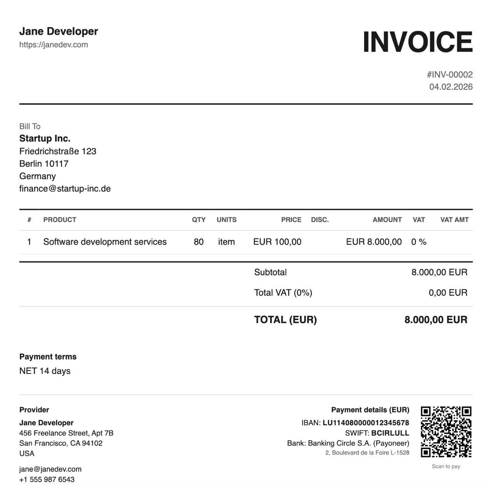

# Invoice CRM

[](https://github.com/fortunto2/invoice-crm)
[](https://opensource.org/licenses/MIT)
[](https://www.python.org/downloads/)

**Free, open-source invoice generator for freelancers and small businesses. File-based, git-friendly, AI-agent compatible. No SaaS, no monthly fees.**



A file-based mini CRM for generating professional invoices, letters, and company detail cards using Python, Jinja2, Pydantic, and WeasyPrint.

## Features

- **Invoice Generation** - Professional PDF invoices with QR codes for payments
- **Letter Generation** - Business letters with customizable templates
- **Company Cards** - Bank details cards with payment QR codes
- **Digital Signatures** - Optional PDF signing with self-signed certificates
- **File Encryption** - Optional encryption using [age](https://age-encryption.org)
- **Multiple Banks** - Support for multiple bank accounts per provider
- **QR Payment Codes**:
  - EUR: EPC/SEPA format (European banking apps)
  - TRY: EMVCo format (Turkish banking apps)
  - USD: SWIFT text format
  - Crypto: USDT/BTC addresses

## Examples

See the `examples/` directory for sample generated PDFs:
- `invoice-acme-corp.pdf` - Invoice for US client
- `invoice-startup-inc.pdf` - Invoice for EU client (EUR)
- `example-llc-details.pdf` - Company card with bank details
- `freelancer-details.pdf` - Individual freelancer card

## Quick Start

```bash
git clone https://github.com/fortunto2/invoice-crm.git
cd invoice-crm
make install           # install dependencies
make validate          # check configs
make invoice-acme      # generate invoice
make cards             # generate company cards
```

## Project Structure

```
invoice-crm/
├── crm.py              # Main CLI tool
├── qr.py               # QR code generator (EPC, EMVCo, SWIFT, Crypto)
├── signing.py          # PDF digital signatures (pyHanko)
├── crypto.py           # Optional age encryption
├── schemas.py          # Pydantic schemas
├── Makefile            # Common commands
├── providers/          # Your companies (YAML)
│   └── example-llc.yaml
├── clients/            # Your clients (YAML)
│   └── acme-corp.yaml
├── templates/          # Jinja2 + CSS templates
│   ├── base.css
│   ├── invoice.html
│   ├── letter.html
│   └── card.html
├── assets/             # Logos, signatures (PNG)
├── .certs/             # PDF signing certificates (gitignored)
├── archive/            # Generated invoices (by client)
└── cards/              # Generated company cards
```

## Make Commands

```bash
# Generate
make invoice-acme      # invoice for ACME Corp
make invoice-startup   # invoice for Startup Inc
make cards             # all company cards
make letter-example    # example letter

# Setup & Info
make install           # install dependencies
make validate          # validate YAML configs
make list              # list providers and clients
make history-acme-corp # client history

# PDF Signing
make cert-all          # create certificates for all providers
make cert-info         # show certificate info

# Encryption (optional)
make encrypt-setup     # generate age key
make encrypt-archive   # encrypt archive/
make encrypt-cards     # encrypt cards/
make decrypt-archive   # decrypt archive/
make decrypt-cards     # decrypt cards/

make clean             # remove generated PDFs
make help              # show all commands
```

### CLI (for custom options)

```bash
uv run python crm.py invoice CLIENT [--qty 80] [--rate 100] [--currency EUR]
uv run python crm.py letter CLIENT -p PROVIDER -s "Subject" -b "Body"
uv run python crm.py card PROVIDER [-b bank1,bank2]
```

Run `uv run python crm.py --help` for all options.

## Configuration

### Provider (Your Company)

```yaml
# providers/example-llc.yaml
name: Example LLC
type: corporation  # corporation, limited, individual

address:
  street: 123 Business Ave
  suite: Suite 100
  city: New York
  state: NY
  zip: "10001"
  country: USA

contact:
  email: billing@example.com
  phone: "+1 555 123 4567"
  website: https://example.com

tax:
  tin: "12-3456789"
  vat: null  # or VAT number if applicable

banks:
  wise-usd:
    currency: USD
    country: USA
    default: true
    holder: Example LLC
    account: "123456789"
    routing: "084009519"
    swift: TRWIUS33
    bank_name: Wise (TransferWise)
    bank_address: 30 W. 26th Street, New York, NY 10010

signer:
  name: John Smith
  title: CEO
  signature: assets/signature.png  # optional

logo: assets/logo.png  # optional
disclaimer: "Thank you for your business!"
```

### Client

```yaml
# clients/acme-corp.yaml
name: ACME Corporation
type: corporation

address:
  street: 456 Client Street
  city: Los Angeles
  state: CA
  zip: "90001"
  country: USA

contact:
  name: Jane Doe
  email: billing@acme.com

defaults:
  provider: example-llc
  currency: USD
  rate: 100.00
  hours: 40
  payment_terms: NET 30 days
```

## Banks & QR Codes

Each provider can have multiple bank accounts. QR codes are auto-generated based on currency:

| Currency | QR Format | Compatibility |
|----------|-----------|---------------|
| EUR | EPC/SEPA | All EU banking apps |
| TRY | EMVCo (TR.TCMB.FAST) | Turkish banking apps |
| USD | SWIFT text | Manual entry |
| USDT/BTC | Crypto address | Wallet apps |

## PDF Digital Signatures

All PDFs can be digitally signed with self-signed certificates.

```bash
make cert-all    # create certificates for all providers
make cert-info   # view certificates
```

Recipients see signature info in Adobe Reader's Signatures panel.

## Encryption (Optional)

Encrypt sensitive PDFs using [age](https://age-encryption.org).

```bash
# Install age
brew install age  # macOS
apt install age   # Linux

# Setup and use
make encrypt-setup     # generate encryption key
make encrypt-archive   # encrypt archive/
make decrypt-archive   # decrypt archive/
```

## File Naming

- Invoices: `archive/{client}/YYYY-MM-DD_Invoice_INV-XXXXX.pdf`
- Letters: `archive/{client}/YYYY-MM-DD_LTR-XXXXX_{subject}.pdf`
- Cards: `cards/{provider}-details.pdf`

Document numbers are auto-incremented in `.counters.json`.

## Requirements

- Python 3.11+
- [uv](https://docs.astral.sh/uv/) — fast Python package manager
- macOS: `brew install pango`
- Linux: `apt install libpango-1.0-0 libpangocairo-1.0-0`
- Optional: `brew install age` (encryption)

### Installing uv

```bash
# macOS / Linux
curl -LsSf https://astral.sh/uv/install.sh | sh

# macOS (Homebrew)
brew install uv

# Windows
powershell -ExecutionPolicy ByPass -c "irm https://astral.sh/uv/install.ps1 | iex"
```

See [uv installation docs](https://docs.astral.sh/uv/getting-started/installation/) for more options (pip, pipx, Docker, etc.)

## Setup with AI Agent

You can configure everything using Claude Code, Cursor, or any AI coding assistant.

### Initial Setup

Tell your agent:

```
Set up invoice-crm for my company:
- Company: My Company LLC, Delaware
- Address: 123 Main St, New York, NY 10001
- Email: billing@mycompany.com
- Bank: Wise USD, account 123456789, routing 084009519

Add a client:
- Name: ACME Corp
- Address: 456 Oak Ave, Los Angeles, CA 90001
- Email: ap@acme.com
- Default rate: $150/hour, 40 hours
```

The agent will create `providers/my-company.yaml` and `clients/acme.yaml`.

### Daily Usage

```
Invoice ACME for 80 hours at $150
Invoice ACME for January, 60 hours
Create invoice for ACME: 40h consulting at €100, 20h code review at €80
Generate bank details card for my company
```

Or use Make commands directly:

```bash
make invoice-acme
make cards
make list
```

---

## FAQ

### General

**What is this?**

A file-based CLI tool for generating professional PDF invoices. All data (clients, providers, bank details) lives in YAML files on your machine. No database, no SaaS, no monthly fees.

**Who is this for?**

Freelancers, consultants, and small businesses who want:
- Full control over their financial data
- Git-friendly invoicing (version control your configs)
- Integration with AI coding agents (optional)
- No subscription fees

### AI & Privacy

**Do I need Claude or any AI to use this?**

No. It's a pure Python CLI. Run `make invoice-acme` - no AI required.

**Then why mention AI at all?**

AI agents make certain tasks easier:
1. **Initial setup** - configuring YAML files with client details, bank accounts, company info
2. **Complex invoices** - multiple line items, custom descriptions
3. **Template customization** - HTML/CSS branding work
4. **Natural language** - for those who prefer talking over typing CLI commands

**Does the AI see my bank details?**

Not necessarily. The architecture separates concerns:
- Bank details live in config files (`providers/*.yaml`)
- When generating an invoice, you only pass: client name, amount, hours
- The script pulls credentials from configs deterministically
- The agent never needs to see your actual IBAN/SWIFT

This protects against hallucinations - the LLM can't invent wrong bank details because it never handles them.

**Can I use a local model instead of Claude?**

Yes. Use Ollama, LM Studio, or any local LLM. The tool doesn't care what triggers it - it's just a CLI script.

**Is my data sent anywhere?**

Only if you choose to:
- Use a cloud LLM (Claude, GPT) - then your prompts go to their API
- Push to public GitHub - don't do this with real data

For maximum privacy:
- Use as CLI only (no AI)
- Or use a local model
- Keep configs in a private repo or gitignored

### Security Best Practices

**What files contain sensitive data?**

```
providers/     # Your company details, bank accounts
clients/       # Client details (less sensitive, but still private)
archive/       # Generated invoices with amounts
.certs/        # PDF signing certificates (already gitignored)
```

**How should I set up my repo?**

**Option 1:** Private repository - keep everything in a private GitHub/GitLab repo

**Option 2:** Gitignore sensitive folders:
```
providers/
clients/
archive/
```

**Option 3:** Encrypt sensitive files:
```bash
make encrypt-archive
make encrypt-cards
```

**Can the AI hallucinate wrong bank details?**

No. Bank details come from deterministic config files, not LLM generation. The agent's job is to trigger the script with the right parameters - the script reads credentials from your trusted YAML files.

### Comparison

| Feature | Typical SaaS | Invoice CRM |
|---------|--------------|-------------|
| Monthly cost | $10-60/month | Free |
| Data location | Their servers | Your machine |
| Offline work | No | Yes |
| Version control | No | Yes (git) |
| AI integration | Limited | Full (any agent) |
| Customization | Template picker | Full HTML/CSS/Jinja2 |

## License

MIT License - see [LICENSE](LICENSE)
